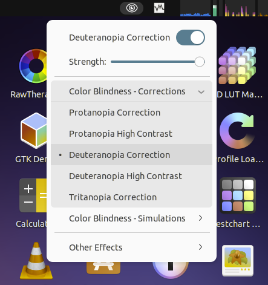

# Colorblind Filters
A GNOME Shell extension for main panel that offers full-screen color filters that should help color-blind users and developers.

Supports GNOME Shell 3.36 - 49

## Screenshot

## Installation
#### GNOME 45+

    git clone https://github.com/G-dH/gnome-colorblind-filters.git
    cd gnome-colorblind-filters
    make install

#### GNOME 3.36-44

    git clone https://github.com/G-dH/gnome-colorblind-filters.git
    cd gnome-colorblind-filters
    git checkout gnome-3.36-44
    make install

## Contribution
Contributions are welcome and I will try my best to answer quickly to all suggestions.

If you like my work and want to keep me motivated, give me some feedback.
You can also [buy me a coffee](https://buymeacoffee.com/georgdh).
